# Building a Hobby Operating System on Apple Silicon

This repository is the source code and book for an AArch64 hobby
operating system that boots natively on Apple Silicon Macs (M1, M2,
M3, M4 and later) under QEMU's HVF accelerator. It runs as a
monolithic kernel on QEMU's `virt` machine, talks to the world over
virtio-mmio devices, and ships with a GUI desktop, a TCP/IP stack,
and a small web browser — all written in C and a little AArch64
assembly, all built in this tree.

The accompanying book — *Building a Hobby Operating System on Apple
Silicon* — walks through every milestone in the order it was
implemented, with each chapter pointing at the exact files and
regression test that prove the milestone works. Read it as a tour
of the codebase, or use it as a recipe to build the same OS yourself.


The screenshot above is `make run-graphical` on an M2: the launcher
in the top-left, `notepad` editing a tmpfs file, `gui_term` running
`ps`, and two `/bin/browser` windows — one on Hacker News, one on a
PNG colour-swatch test page — all composited by the in-kernel WM
over a userspace-rendered wallpaper, with the taskbar and live
clock along the bottom.

## Architecture at a glance

A single diagram of every kernel and userspace component shipped so
far. Boxes inside `KERNEL` run at EL1 in a single shared address
space; boxes inside `USERSPACE` run at EL0, each in its own MMU
world, talking to the kernel through `svc` syscalls and to each
other through the kernel's named-IPC channels (`srv`).

```mermaid
flowchart TB
  classDef hw    fill:#fff7e0,stroke:#b88600,color:#3b2a00
  classDef drv   fill:#eaf3ff,stroke:#2c6cb6,color:#0c2e60
  classDef core  fill:#f0e7ff,stroke:#6a3fb8,color:#241355
  classDef net   fill:#dff3e6,stroke:#2c7d4f,color:#0d3b20
  classDef ulib  fill:#fff0f5,stroke:#a83a73,color:#43102b
  classDef udmn  fill:#ffeede,stroke:#b86a2c,color:#5a2a08
  classDef uapp  fill:#e6f7ff,stroke:#1f7aa6,color:#072a3d

  subgraph HOST["macOS host on Apple Silicon"]
    HVF["Hypervisor.framework (HVF)"]
    QEMU["qemu-system-aarch64 -M virt,gic-version=3"]
    HVF --> QEMU
  end
  class HVF,QEMU hw

  subgraph HW["QEMU virt hardware (virtio-mmio bus)"]
    direction LR
    UART["PL011 UART"]
    GIC["GICv3"]
    PSCI["PSCI (CPU bringup)"]
    VBLK["virtio-blk x2"]
    VGPU["virtio-gpu"]
    VKBD["virtio-keyboard"]
    VTAB["virtio-tablet"]
    VNET["virtio-net (SLIRP)"]
    VSND["virtio-snd"]
    VRNG["virtio-rng"]
  end
  class UART,GIC,PSCI,VBLK,VGPU,VKBD,VTAB,VNET,VSND,VRNG hw
  QEMU --> HW

  subgraph KERNEL["KERNEL — kernel/ (EL1, monolithic, AArch64)"]
    direction TB

    subgraph ARCH["arch/ — CPU + boot"]
      direction LR
      BOOT["boot.s, vectors.S"]
      MMU["MMU, page_tables"]
      CSW["context_switch, spinlocks"]
      SMP["psci, ipi (GICv3 SGI)"]
    end
    class BOOT,MMU,CSW,SMP core

    subgraph KDRV["device/ — drivers"]
      direction LR
      DBLK["virtio_blk + blk_cache"]
      DGPU["virtio_gpu + fb"]
      DIN["virtio_input"]
      DTAB["virtio_tablet"]
      DNET["virtio_net"]
      DSND["virtio_snd"]
      DRNG["virtio_rng"]
      DGIC["gic"]
    end
    class DBLK,DGPU,DIN,DTAB,DNET,DSND,DRNG,DGIC drv

    subgraph KCORE["core/ — kernel services"]
      direction TB
      SYS["syscall dispatcher (~95 calls)"]
      THR["threads + per-CPU scheduler + runqueue"]
      MM["heap, pmem, mmap, page_cache"]
      AS["per-process address_space"]
      ELF["ELF loader"]
      VFS["VFS"]
      OSFS["osfs2 (read-only on disk)"]
      TMPFS["tmpfs (rw, in RAM)"]
      PIPE["pipe, pty, console_in"]
      PROCFS["procfs (/proc/&lt;pid&gt;/...)"]
      STRACE["strace channels"]
      WT["walltime (RTC + monotonic)"]
      RAND["ChaCha20 CSPRNG (virtio-rng seeded)"]
      SRV["srv — named IPC channels"]
      WIN["win_fb + WM shadow windows"]
    end
    class SYS,THR,MM,AS,ELF,VFS,OSFS,TMPFS,PIPE,PROCFS,STRACE,WT,RAND,SRV,WIN core

    subgraph KNET["core/ — network stack"]
      direction LR
      ETH["eth + arp"]
      IP4["ipv4"]
      ICMP["icmp"]
      UDP["udp"]
      DHCP["dhcp client"]
      DNS["dns resolver"]
      TCP["tcp (client + listen/accept)"]
      LO["lo0 loopback"]
    end
    class ETH,IP4,ICMP,UDP,DHCP,DNS,TCP,LO net
  end

  HW   --> KDRV
  KDRV --> KCORE
  KDRV --> KNET
  KNET --> KCORE
  KCORE --> ARCH

  subgraph USER["USERSPACE — userspace/ (EL0, one process per box)"]
    direction TB

    subgraph ULIB["libraries"]
      direction LR
      LC["libc + crt0"]
      LG["libgui + wmclient"]
      BR["BearSSL + tls_socket"]
      JS["pocketjs + jsdom"]
      PNG["pngdec"]
    end
    class LC,LG,BR,JS,PNG ulib

    subgraph DAEMONS["daemons (PID 1 spawns + supervises)"]
      direction LR
      INIT["init (PID 1)"]
      WSD["wsd — window server"]
      FONTD["fontd — TTF rasteriser"]
      CLIPD["clipboardd"]
      HTTPD["httpd :80"]
      HTTPSD["httpsd :8443 + :8444"]
    end
    class INIT,WSD,FONTD,CLIPD,HTTPD,HTTPSD udmn

    subgraph APPS["apps and tools"]
      direction LR
      SH["sh + ls/cat/grep/ps/top/strace/..."]
      DESKTOP["desktop + wallpaper"]
      LAUNCHER["launcher"]
      TASKBAR["taskbar + clock"]
      NOTEPAD["notepad"]
      PAINT["paint"]
      TERM["gui_term"]
      BROWSER["browser (paint / plain / ANSI / GUI)"]
      HTTPGET["httpget"]
      TLSTEST["tlstest, getrand, echod, ..."]
    end
    class SH,DESKTOP,LAUNCHER,TASKBAR,NOTEPAD,PAINT,TERM,BROWSER,HTTPGET,TLSTEST uapp
  end

  USER =="svc # syscalls"==> KCORE
  APPS --> LG
  LG  =="srv IPC"==>  WSD
  LG  =="srv IPC"==>  FONTD
  BROWSER =="srv IPC"==> CLIPD
  NOTEPAD =="srv IPC"==> CLIPD
  BROWSER --> BR
  BROWSER --> JS
  BROWSER --> PNG
  HTTPSD  --> BR
  WSD =="SYS_FB_PRESENT + shadow window"==> WIN
  INIT --> WSD
  INIT --> FONTD
  INIT --> CLIPD
  INIT --> HTTPD
  INIT --> HTTPSD
  INIT --> DESKTOP
  INIT --> LAUNCHER
  INIT --> TASKBAR
  INIT --> SH
  BROWSER --> TCP
  HTTPGET --> TCP
  HTTPD --> TCP
  HTTPSD --> TCP
  SH --> VFS
  NOTEPAD --> VFS
```



What the arrows mean:

- **Solid arrows** are data-plane edges (drivers feed core, core uses arch, kernel services land in the network stack, ...).
- **Thick `==>` arrows** are the two userspace-visible IPC mechanisms: `svc` for the kernel syscall ABI, and `srv` named channels for daemon-to-client traffic (window server, font server, clipboard).
- The **`wsd` box** is the chapter 108d–e milestone: the compositor, cursor, decorations, and resize live in a userspace process; the kernel keeps `win_fb` for backing storage and "shadow" WM windows that `wsd` uses for hit-testing and input delivery.
- The **`BearSSL` box** is vendored TLS 1.2: every `https://` handshake (browser, `httpsd`, `tlstest`) goes through one `tls_socket` API and one ~130-anchor `ca.bundle` derived from the host's system trust store.

## Why AArch64? Why HVF?

Most "build a hobby OS" books target x86-64 because that is what the
authors learned on. On a MacBook Pro M2 (and every other Apple
Silicon Mac), running an x86-64 guest means running every guest
instruction through QEMU's TCG software translator — so even the
fastest part of your kernel runs perhaps 1/20th the speed of the
hardware sitting an inch away. Worse, you cannot use SMP usefully,
graphics is slow, and the boot pipeline is dominated by 1990s-era
legacy decisions (BIOS, A20, GDT, TSS, real mode, the 8259 PIC) that
have nothing to teach a modern OS engineer.

This book takes a different bet: build an aarch64 kernel from the
start, run it on QEMU's `virt` machine, and accelerate every guest
instruction through Apple's `Hypervisor.framework` (HVF). The result
is a kernel that boots in under a second on an M2, can usefully
schedule real SMP, draws into a high-resolution framebuffer through
virtio-gpu, and has zero legacy 1980s baggage.

It is also, accidentally, the better way to teach the subject. There
are no segments, no real-mode dance, no GDT or TSS, no 8259 PIC, no
A20 line, and no ACPI tangle. Every chapter teaches a feature of
modern systems hardware, not a workaround for legacy hardware.

## Reading mode

This is a book and a codebase that move together. The expected
workflow is:

1. Read a chapter.
2. Build the corresponding milestone tag of the kernel.
3. Run it under QEMU and confirm the behaviour the chapter promises.
4. Move on.

You do not need prior operating-systems-development experience, but
you should be comfortable reading C, reading assembly with a
reference open, and using a debugger.

## Quick start

```bash
brew install aarch64-elf-gcc aarch64-elf-binutils qemu

make toolchain-check
make all

# Text-mode (serial only):
make run

# Graphical (Cocoa window + virtio-gpu, 1920x1080 by default):
make run-graphical
# Or pick a smaller framebuffer:
make run-graphical FB_RES=1280x800

# Force the TCG software interpreter (e.g. on a non-Apple-Silicon Mac):
make run-tcg
```

Press `Ctrl-A X` (in the terminal hosting the serial) or close the QEMU
window to quit.

The regression sweep that gates every chapter lives in `scripts/`:

```bash
./scripts/sweep.sh
```

## Where to start reading

- [Book index](book/INDEX.md) — master table of contents and status
  table, broken into fifteen parts.
- [Chapter 1: Why Apple Silicon, why aarch64, why now](book/chapters/01-foundations/01-why-apple-silicon.md)
  — the design argument in long form.
- [Chapter 3: First boot](book/chapters/01-foundations/03-first-boot.md)
  — the smallest thing that prints to the UART.

## What works today

Booting `make run-graphical` drops you onto a desktop with a
wallpaper, a taskbar with a live clock, and a launcher you can click
to open windowed apps:

- **GUI desktop** — userspace window server (`wsd`), virtio-gpu
  framebuffer, virtio-keyboard and virtio-tablet input,
  focus/drag/close/minimize, live window resize, taskbar with
  window list, toast notifications, userspace wallpaper. The
  compositor, cursor, title bars, and decoration all run in
  `wsd` (EL0); the kernel keeps only `win_fb` backing storage
  and the shadow-window input bus.
- **GUI applications** — `notepad` (text editor with writable
  tmpfs save), `paint`, `gui_term` (a terminal in a window),
  `launcher`, `taskbar`, `browser`.
- **Shell and userland** — a line-editor shell with kill-ring
  readline keys, env vars, quoting, `cd`/`pwd`, pipelines,
  redirection (`<`, `>`, `>>`), background jobs, and the usual
  small tools (`ls`, `cat`, `grep`, `wc`, `head`, `tail`, `echo`,
  `env`, `sleep`, `uptime`, `time`).
- **Filesystems** — a classical Unix VFS with a longest-prefix
  mount table dispatching through a `struct fs_ops` vtable (Part
  XVI, chapter 113); six mounts in the live table (`/`, `/proc`,
  `/tmp`, `/mnt`, `/bin`, `/data`), each enforcing its `MOUNT_RO`
  flag uniformly via `EROFS_VFS`; a read-only on-disk OSFS plus a
  writable in-memory `tmpfs` and a writable on-disk OSFS-2 for
  `/data`, all fronted by a block cache over virtio-blk; `/bin/mount`
  prints the live table from userspace via the new `SYS_MOUNTS`
  syscall.
- **Networking** — virtio-net, full Ethernet/ARP/IPv4 stack,
  ICMP echo, UDP, a DHCP client, a TCP state machine with both
  client (`connect`) and server (`listen`/`accept`) paths, BSD-
  shaped socket syscalls, a DNS resolver, lo0 loopback, and a
  URL / HTTP/1.1 parser. `/bin/httpget http://example.com/`
  works, and `/bin/httpd` serves OSFS files from inside the
  guest on port 80.
- **TLS and HTTPS** — vendored BearSSL 0.6 built freestanding,
  a ChaCha20 CSPRNG reseeded from virtio-rng, a ~130-anchor
  `ca.bundle` lifted from the host's system trust store at build
  time, and a uniform `tls_socket` API used by both `/bin/httpsd`
  (serves HTTPS on `:8443` RSA + `:8444` ECDSA) and `/bin/browser`
  (typing `news.ycombinator.com` performs a real chain-validated
  TLS 1.2 handshake against the live public site).
- **Browser** — `/bin/browser` parses HTML, builds a DOM, parses
  CSS, runs a CSS-driven layout engine, decodes PNG/JPEG, fetches
  external stylesheets and images over `http://` *or* `https://`,
  evaluates a pocket-sized JavaScript (`pocketjs`) for `onclick`
  handlers, submits HTML forms with cookies under a same-origin
  policy, and renders in four modes: `paint` (raw paint commands),
  `plain`, `ANSI`, and `GUI` (resizable window, address bar,
  back/forward, click-to-navigate).
- **IPC and clipboard** — kernel `srv` named-channel IPC carries
  a userspace `clipboardd` that `notepad` and `browser` both
  speak to for cut/copy/paste, plus the `wmclient` <-> `wsd` and
  `libgui` <-> `fontd` traffic that backs every window on screen.
- **SMP and memory** — two cores brought up via PSCI, atomics
  and spinlocks, IPIs through GICv3 SGIs, a per-CPU runqueue,
  `mmap` over a unified page cache, userspace threads via
  `clone`, `CLONE_FILES` with a refcounted FD table, and a
  dedicated browser parser thread that takes HTML/CSS/layout
  off the GUI core.
- **System services** — a real RTC and wall-clock time,
  virtio-snd boot chime and `beep`, PNG decoding (truecolour,
  palette, grayscale) with a content-type sniffer feeding the
  browser image cache, TrueType fonts rasterised in `fontd`,
  a `/proc`-shaped pseudo-filesystem with `ps` and `top`, and
  `strace` over `/proc/<pid>/trace`.

## Project status

The codebase tracks the book chapter by chapter. As of chapter 113g
(`MOUNT_RO` + `EROFS_VFS` hardening, completing Part XVI's first
half — the mount-table refactor), every part through XV — Browser
Maturation — has been shipped end to end, the prefix-special-cased
VFS ladders have been replaced with a `struct fs_ops` vtable
dispatched through a longest-prefix-match mount table, `/bin/mount`
prints the live table via the new `SYS_MOUNTS` syscall, and every
mutation against a read-only mount returns `EROFS_VFS` uniformly.
The headline gaps still open on the roadmap are:

- **Part IX — Process Model.** A POSIX-shaped `fork`/`exec`/COW
  pair with signals and job control. `init` and the shell currently
  use a `spawn`+`wait` syscall pair instead; the chapter sequence
  to retire it (73–79) is stubbed and being written.
- **Part X — Persistence.** A writable on-disk filesystem with a
  small journal so `notepad` saves, shell history, and browser
  cookies survive reboot. Today writes go to in-memory `tmpfs`.
- **Part XVI — Filesystem Architecture, second half.** The
  mount-table refactor (chapter 113) is done; user-space
  filesystem servers via a 9P-shaped RPC and `SYS_MOUNT`/
  `SYS_UMOUNT` (chapter 114) is the next milestone.
- **Part XVII — Self-hosting GCC.** A POSIX-ish libc growth pass,
  `/bin/as` + `/bin/ld` + `/bin/ar` + a crt0/libgcc shim, a TinyCC
  native port, and eventually GCC building itself on the OS.

See the [project status snapshot](book/INDEX.md#project-status-snapshot)
in the book index for the canonical chapter-by-chapter table.
